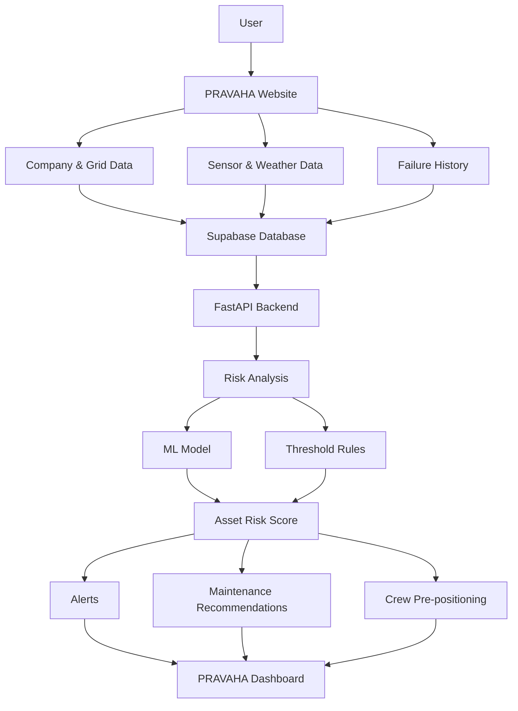

# Architecture

## System Architecture

## Components

| Component     | Technology           | Responsibility                                         |
| ------------- | -------------------- | ------------------------------------------------------ |
| Frontend      | React + Vite         | Website, data entry and dashboard                      |
| Backend API   | FastAPI              | Process data and handle API requests                   |
| AI / ML       | Python, scikit-learn | Predict and calculate asset risk                       |
| Database      | Supabase PostgreSQL  | Store company, asset, sensor, weather and failure data |
| Risk Analysis | ML + Threshold Rules | Calculate risk for each asset                          |

## Data Flow

1. User enters company, region, asset, sensor, weather and failure information.
2. The data is stored in Supabase PostgreSQL.
3. FastAPI retrieves the required asset data.
4. PRAVAHA analyzes each asset separately.
5. The ML model and/or threshold rules calculate the asset risk.
6. The system generates a risk score and identifies possible failures.
7. Alerts, maintenance recommendations and crew-planning suggestions are created.
8. The results are displayed on the PRAVAHA dashboard.

## Security Considerations

* Sensitive credentials are stored in environment variables.
* `.env` files are excluded from GitHub.
* `.env.example` contains only the required variable names.
* Supabase Row Level Security is used where configured.
* Sensitive database credentials are not exposed in the frontend.

## Scalability Notes

PRAVAHA can be scaled by adding real-time sensor data, more assets and multiple companies. The FastAPI backend can be scaled independently, while the database and risk engine can later support larger numbers of assets and continuous monitoring.
