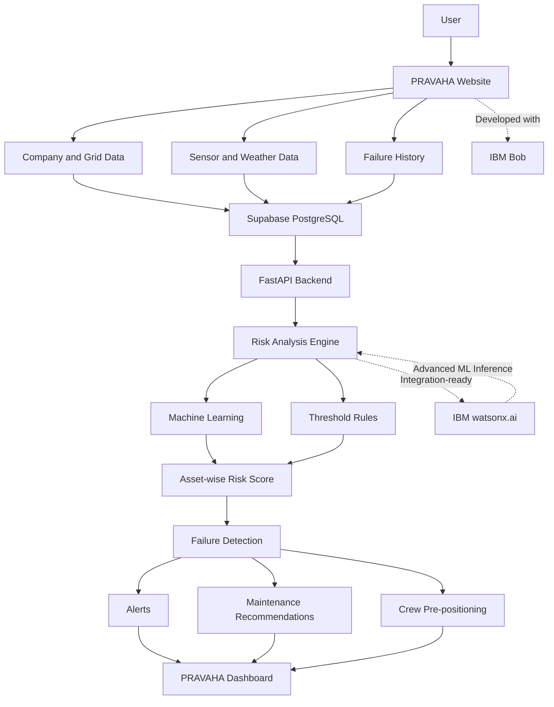
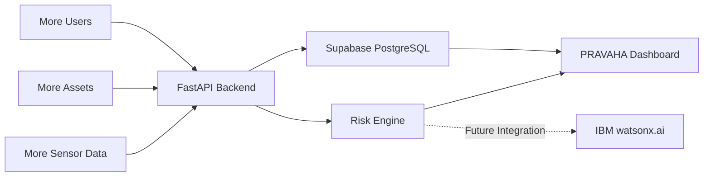

# Architecture

## System Architecture

## Components

| Component               | Technology           | Responsibility                                         |
| ----------------------- | -------------------- | ------------------------------------------------------ |
| Frontend                | React + Vite         | Website, data entry and dashboard                      |
| Backend API             | FastAPI              | Process data and handle API requests                   |
| AI / ML                 | Python, scikit-learn | Predict and calculate asset risk                       |
| IBM AI Integration      | IBM watsonx.ai       | Integration-ready layer for advanced ML inference      |
| Database                | Supabase PostgreSQL  | Store company, asset, sensor, weather and failure data |
| Risk Analysis           | ML + Threshold Rules | Calculate risk separately for each asset               |
| AI-assisted Development | IBM Bob              | Assisted development of the PRAVAHA solution           |

## Data Flow

1. The user enters company, region, asset, sensor, weather and failure information.
2. The data is stored in Supabase PostgreSQL.
3. FastAPI retrieves the required asset data.
4. PRAVAHA analyzes each asset separately.
5. The risk engine uses machine-learning and/or threshold-based rules to calculate asset risk.
6. The architecture is prepared to use **IBM watsonx.ai** for advanced ML inference.
7. The system generates an asset-specific risk score and identifies possible failures.
8. Alerts, maintenance recommendations and crew-planning suggestions are generated.
9. The results are displayed on the PRAVAHA dashboard.

## Security Considerations

* Sensitive credentials are stored in environment variables.
* `.env` files are excluded from GitHub.
* `.env.example` contains variable names without secret values.
* Supabase Row Level Security is used where configured.
* Sensitive database credentials are not exposed in the frontend.
* IBM service credentials, when used, should also be stored as environment variables.

## Scalability Notes

PRAVAHA can later scale to larger numbers of companies, assets and real-time sensor streams. IBM watsonx.ai can be added as the advanced ML inference layer, while the FastAPI backend, database, and frontend can continue to scale independently.
