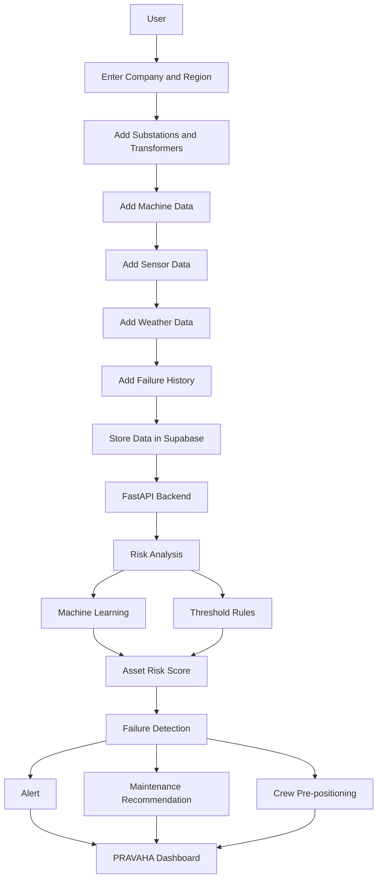
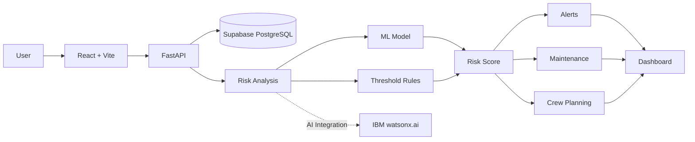

# Solution Overview

## What We Built

PRAVAHA is a power-grid monitoring platform that helps operators find **which transformer or machine is at risk before it fails**.

It combines machine readings, weather conditions, and past failure information, analyzes each asset separately, and converts the result into a clear action for the operator.

```text
Machine Data
     +
Weather Data
     +
Failure History
     ↓
PRAVAHA
     ↓
Risk Analysis
     ↓
Action
```

PRAVAHA is built with an IBM-ready AI architecture and can use **IBM watsonx.ai** for advanced AI-based risk prediction.

---

## How It Works



### Step-by-Step

1. The user enters the **company and region**.
2. The user adds **substations, transformers, and other machines**.
3. The system receives **sensor readings, weather conditions, and past failure records**.
4. The information is stored in **Supabase PostgreSQL**.
5. The FastAPI backend retrieves the required data.
6. PRAVAHA checks **each machine separately**.
7. The risk engine uses **machine learning and threshold rules** to calculate risk.
8. The system identifies possible failures and assigns a **risk score**.
9. High-risk conditions generate **alerts**.
10. PRAVAHA provides **maintenance recommendations**.
11. The system suggests **crew pre-positioning** for critical assets.
12. All results are shown on the **PRAVAHA dashboard**.

---

## Architecture Diagram



> See [`architecture.md`](architecture.md) for the detailed system architecture.

---

## Key Design Decisions

| Decision                                     | Rationale                                                                                                            |
| -------------------------------------------- | -------------------------------------------------------------------------------------------------------------------- |
| **Analyze each asset separately**            | Different machines have different conditions, so each asset needs its own risk score instead of one common value.    |
| **Combine sensor, weather and failure data** | Using multiple inputs gives a broader view of the conditions that may lead to equipment failure.                     |
| **Use ML with threshold rules**              | ML provides prediction capabilities while threshold rules make the risk calculation easier to understand and verify. |
| **Use Supabase PostgreSQL**                  | Provides a central place to store and retrieve company, asset, sensor, weather and failure information.              |
| **Use an IBM AI-ready architecture**         | Allows PRAVAHA to connect with IBM watsonx.ai for advanced AI-powered prediction and decision support.               |

---

## IBM Technologies Used

* **IBM Bob:** Used during the development process to assist in building and refining the PRAVAHA application.
* **IBM watsonx.ai:** Used as the AI/ML technology layer for risk prediction and analysis within the PRAVAHA solution.

```text
PRAVAHA Data
     ↓
Risk Analysis
     ↓
IBM watsonx.ai
     ↓
Risk Prediction
     ↓
PRAVAHA Dashboard
```
